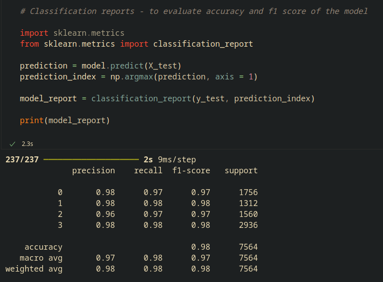
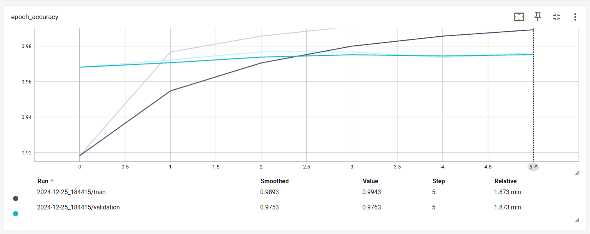
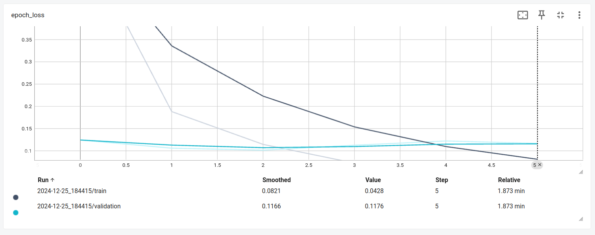
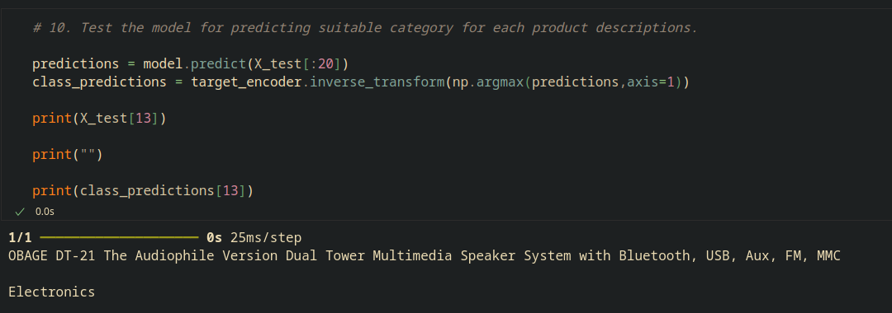
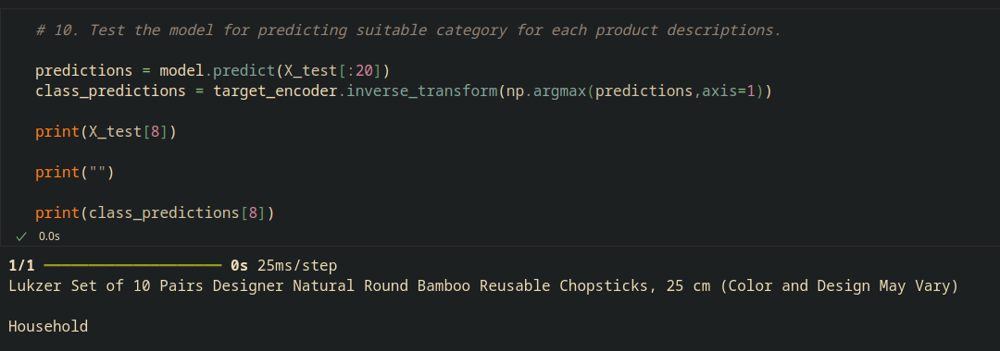
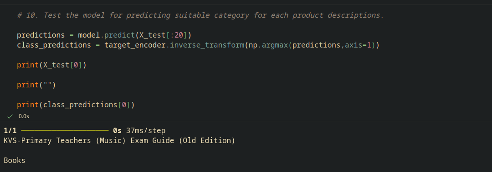
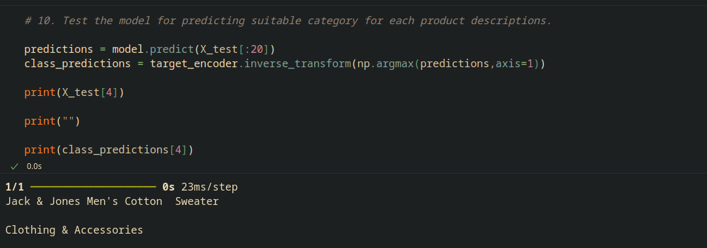

# Project : E-commerce Text Classification by Neural Language Processing
Made by muhd-syuhaidi

### Introduction:
As a human, we can simply distinguish and categorize a product based on its text description. For example, if the product is described as a laptop is equipped with a powerful graphic card which is optimized well for gaming and content creation, it can be put under 'Electronics' category because it contains electronic companents. Similar case for television and even gaming consoles. However, when dealing with an increasing number of various products, this might take a lot of time for categorization of each products by human manual forces. Thus, it is absolutely not efficient for businesses especially an E-commerce platform.

This reason why companies these days hire analysts to counter this problem for the faster categorization. Their solution is **developing a machine learning to predict a suitable category for each products based on their description automatically**. This has ideated me to create a project to develop a machine learning based on a Neural Language Processing (NLP) to categorize products into 4 categories namely "Electronics", "Household", "Books", and "Clothing & Accessories" using the dataset that has been acquired from Kaggle website (a link into the website is provided under a 'Dataset' subtopic).

### Dataset:
Ecommerce Text Classification:
https://www.kaggle.com/datasets/saurabhshahane/ecommerce-text-classification/data

### Instruction:
In this repo, I have already created the machine learning model in Jupyter notebook file format with a Python programming language (.ipynb). You can download it alongside with the dataset folder (required) in the same directory for it load the dataset for the categorization.

Open the .ipynb file in Microsoft Visual Studio Code (recommended)

Before running it, make sure you have installed a list of required Python packages through pip install as shown below:

```bash
pip install tensorflow numpy pandas
```

### Model Architecture:
The model has been developed based on a Neural Language Processing (NLP) as written below:

```python
model = keras.Sequential()

# a. NLP layers

model.add(tokenizer)
model.add(embedding)

# b. Recurrent Neural Network (RNN)

model.add(keras.layers.Bidirectional(keras.layers.LSTM(16, return_sequences=False)))
model.add(keras.layers.Dropout(0.3))
model.add(keras.layers.Dense(len(df['category'].unique(), activation='softmax')))
```

Note that the RNN has been developed simple and added with Dropout to **prevent an overfitting**.

### Results

- Model Performance



Note that, the accuracy of the model and f1 score of each target classes (category) are almost 100%. This means the model can conduct the prediction very well. So, the product will be categorized almost 100 percent accurately.

- Epoch accuracy (Train versus Validation)



Before the model has been test for prediction, it must be trained first. As you can see, the trained model could achieved almost 100 percent accuracy. In addition, the gap between train and validation run at last epoch is small, meaning the model is in a good fit due to simple RNN layers development plus the dropout.

- Epoch loss (Train versus Validation)



As the accuracy has become better, the loss has decreased. Again, since the RNN has been developed simple and added with the Dropout, the gap between the train and the validation are small to indicate the model is in a good fit.

- Results of categorization by NLP

a. Electronics



b. Household



c. Books



d. Clothing & Accessories




